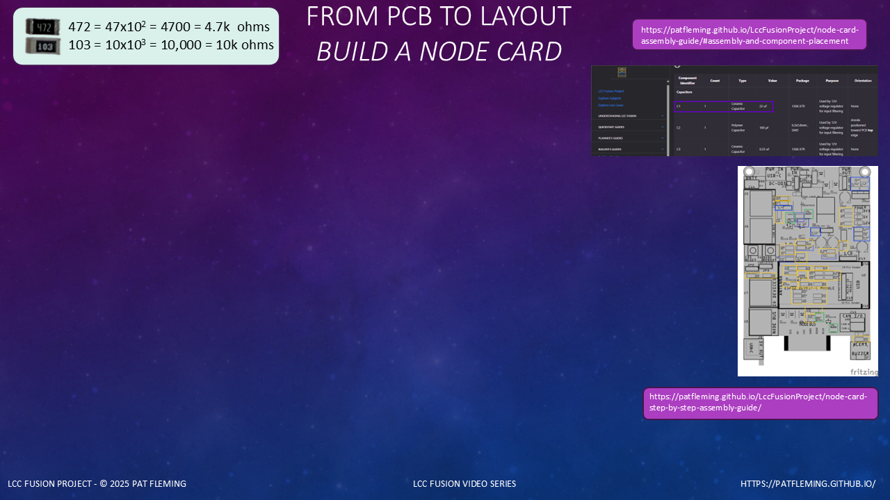
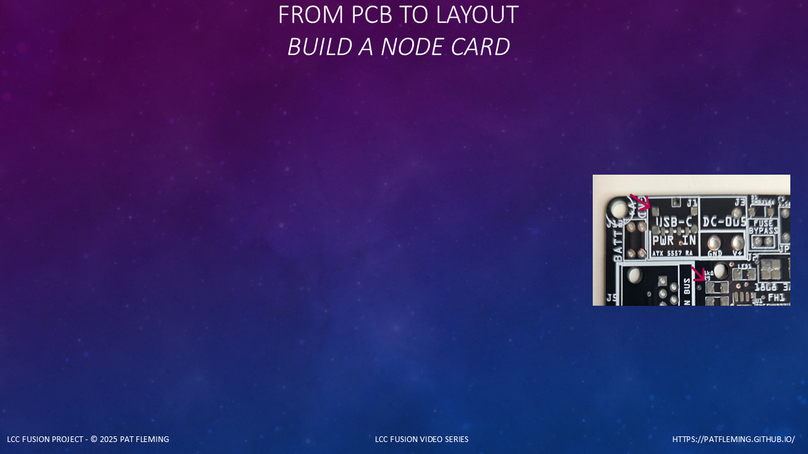
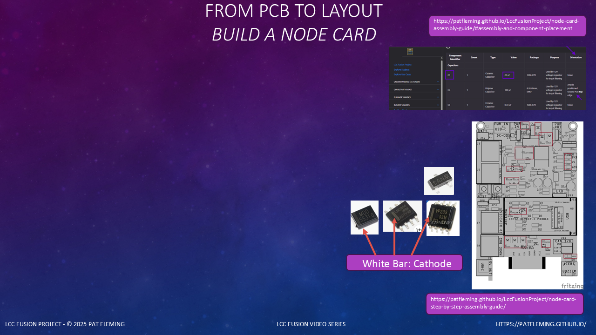
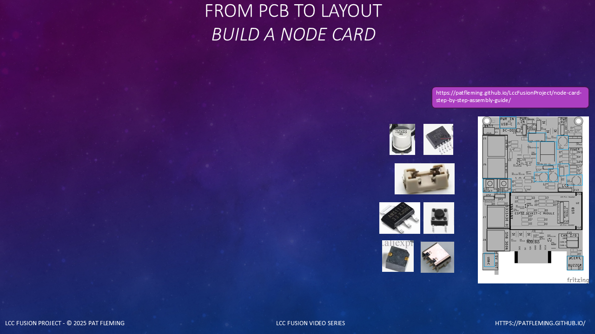
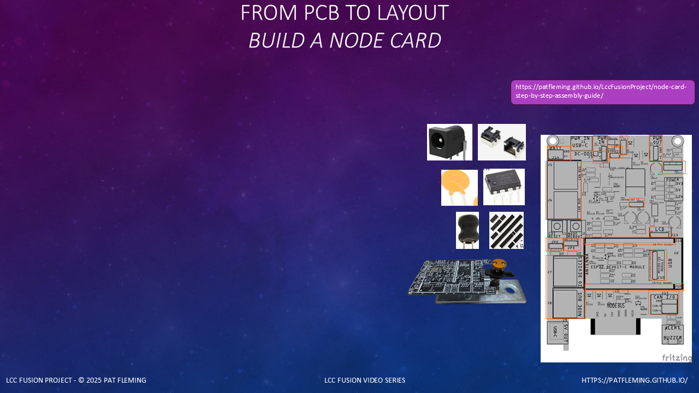
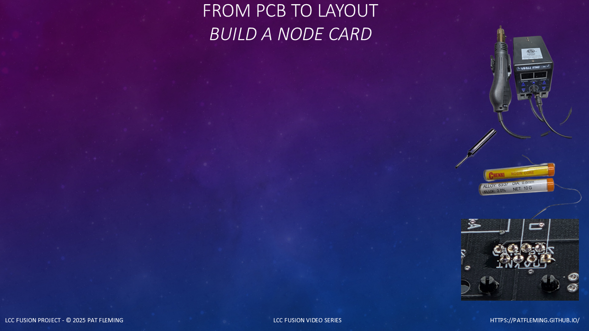

<!-- ========================================================= -->
<!-- Scene: Ordering the PCB                                  -->
<!-- ========================================================= -->

(font-size: 20)



> Start with the correct PCB

```md
# Ordering the Node Card PCB
* Gerber files are ready to upload
* No modifications required
```

Before we start any assembly, the first step is ordering the PCB.

For the  the Gerber files are already prepared
and ready to upload directly to a board fabrication service.

(pause: 0.6)

> Use the recommended fabrication house JLCPCB

```md
# PCB Fabrication
* JLCPCB recommended (low cost)
```

We recommend using JLCPCB for fabrication for low cost quality PCBs.

The Gerber files can be uploaded without modification,
which avoids configuration errors
and ensures the board matches the assembly documentation.

(pause: 0.6)

> Gerber download location

```md
# Gerber Files
* Ready-to-use
* https://patfleming.github.io/LccFusionProject/gerber/
```

Download the Gerber files from the LCC Fusion documentation site,
upload them to JLCPCB,
and place your order.

(pause: 0.6)

---

## Scene — Ordering the Solder Paste Stencil

<!-- ========================================================= -->
<!-- Scene: Ordering the Stencil                              -->
<!-- ========================================================= -->

(font-size: 20)


> Order a stencil with the PCB

```md
# Stencil Ordering
* Order once
* Reusable across builds
```

When ordering the PCB, be sure to also order
a solder paste stencil for this PCB.

The stencil is reusable and only needs to be ordered once,
even if you build multiple boards later.

(pause: 0.6)

> Reduce stencil shipping cost

```md
# Shipping Tip
* Request custom minimal stencil size
```

To reduce stencil shipping costs,
request a custom stencil size.

A 100 × 150 millimeter stencil
is sufficient for the Node Card
and significantly lowers shipping fees.

(pause: 0.6)

Once boards arrive, assembly begins

With the PCB and stencil ordered,
we’re ready to begin the assembly process
when the parts arrive.

(pause: 0.6)

---

<!-- ========================================================= -->
<!-- Scene: Setup                              -->
<!-- ========================================================= -->

(font-size: 20)


```md
# Applying Solder Paste
* Repeatable process
* Designed into the PCB
```

Before applying solder paste, let’s set expectations.

> Applying solder paste with a stencil

This is not a skill test.
You are following a repeatable process that the PCB was designed for.

Modern boards like the LCC Fusion Node Card are assembled using reflow, not by hand-soldering each surface-mount part individually.

(pause: 0.6)

```md
# Why the Stencil Matters
* Controls solder volume
* Prevents bridges
```

> Stencil controls solder accuracy and volume

The stencil is the most important tool in this step.

Its job is controlling how much solder is applied to each pad and
only on the pad.

That prevents solder bridges on fine-pitch parts, wasted paste, 
and ensures reliable joints.

Paste consistency and efficiency are the goals here, not speed.

(pause: 0.6)

```md
# Preparation
* Clean surfaces
* Stable work area
```

> Clean PCB and stencil first

Before applying any paste, both the PCB and the stencil must be clean.

Use isopropyl alcohol to remove oils and residue using a cloth.

Even light handling can affect how solder paste releases from the stencil.

(pause: 0.6)

---

<!-- ========================================================= -->
<!-- Scene: Alignment                              -->
<!-- ========================================================= -->

(font-size: 20)


```md
# Stencil Alignment
* Use tooling holes
* Use push pins to lock stencil in place
```

Stencil alignment is not guesswork.

Place the PCB on a flat foam board, allowing for the use of push pins.

---


> Align using pad cutouts

First, use the pad cutouts to align the stencil directly over the PCB pads.

Then, find the 1 millimeter tooling holes at the top and bottom.

Place a push pin into each hole, locking the stencil in place so it cannot move while
applying the paste.

(pause: 0.6)

---

<!-- ========================================================= --> 
<!-- Scene: Applying paste --> 
<!-- ========================================================= -->

(font-size: 20)


```md
# Applying Paste
* Use a solder paste dispenser / extruder for 30 g syringes
```

> Use an extruder for consistent flow

Using a solder paste dispenser or extruder with a 30-gram syringe
saves time and reduces hand fatigue compared to pushing the syringe by hand.

(pause: 0.6)

---

<!-- ========================================================= --> 
<!-- Scene: Applying paste --> 
<!-- ========================================================= -->

(font-size: 20)


```md
# Spreading Technique
* Smooth motion
* Work in sections
* Hold the stencil down on the PCB
```

Place a small amounts of paste near one area of the stencil.
You do not need to cover the entire board at once.

(pause: 0.6)

Keep the stencil pressed flat against the PCB while applying paste.
This prevents paste from flowing under the stencil
and preserves clean pad definition.

(pause: 0.6)

> Spread in smooth passes

Use a spatula or scrapper to spread the paste across the stencil.

Work in small sections and use one smooth pass per area.

Avoid scraping back and forth repeatedly.

Excess paste can be reused on additional pads as you move across the board.

(pause: 0.6)

---

<!-- ========================================================= --> 
<!-- Scene: Checking the cutout coverage --> 
<!-- ========================================================= -->

(font-size: 20)


> Verify every stencil cutout is filled
> Fix gaps now — not after reflow

Before removing the stencil, stop and verify coverage.

Every stencil cutout should have paste, and it should be completely filled.

If you see gaps, lightly spread paste again in that area.

Work in small sections and scrap the cutout even with the stencil.

Excess paste can be reused to fill additional cutouts.

(pause: 0.6)

---

<!-- ========================================================= --> 
<!-- Scene: Removing Stencil --> 
<!-- ========================================================= -->

(font-size: 20)


```md
# Removing the Stencil
* Vertical lift only
```

> Lift stencil straight up

Once the paste is applied, remove the stencil carefully.

Lift the stencil straight up.
Do not slide it across the board.

Sliding will smear the paste and create solder bridges.

(pause: 0.6)


---

<!-- ========================================================= --> 
<!-- Scene: Inspecting Paste --> 
<!-- ========================================================= -->

(font-size: 20)



```md
# Inspection
* Look for missing or incomplete paste
* Check for bridged pads
* Touch up larger pads if needed
* Restart if fine-pitch pads are missed
* Paste pulls onto pads during reflow
* Paste on silkscreen becomes solder balls
```

Inspect the solder paste before moving on.

Look for any pads that are missing paste or only partially filled.

For larger pads, a small amount of paste can be added if coverage is incomplete.

For fine-pitch or closely spaced pads, it’s better to stop, clean the stencil,
and start over rather than trying to touch them up.

(pause: 0.6)

One important thing to understand about solder paste is how it behaves during reflow.

If paste is touching a pad—even if it’s slightly off-center—
surface tension will pull it onto the pad when the solder melts.

(pause: 0.6)

This means small placement imperfections on larger pads are usually fine.

> Paste on silkscreen melts into solder balls

But this only works when the paste is connected to a pad.

Loose paste on the PCB silkscreen has nothing to pull it into place,
and during reflow it turns into solder balls that can cause shorts later.

(pause: 0.6)

This inspection step is the best time to correct issues.
Reflow will not fix paste mistakes.

(pause: 0.6)

---

<!-- ========================================================= --> 
<!-- Scene: Clean stencil --> 
<!-- ========================================================= -->

(font-size: 20)


```md
# Cleanup
* Clean before paste dries
```

> Clean stencil immediately

Finally, clean the stencil immediately.

Solder paste dries quickly in the stencil's cutouts.

Once dry, it becomes difficult to remove completely.

Check all of the cutouts, especially the smaller ones.

A clean stencil ensures consistent results the next time you use it.

(pause: 0.6)

---

<!-- ========================================================= --> 
<!-- Scene: Prep – Using the Placement Guides                 --> 
<!-- ========================================================= -->

(font-size: 20)


```md
# Placement Prep
* Use the step-by-step build guides
* One image per part category
* Print and keep next to the PCB
```

> Use the build guides as a placement map

Before placing any components, take a moment to prepare your references.

The LCC Fusion documentation includes step-by-step assembly guides
with images that highlight exactly where each category of parts goes.

(pause: 0.6)

Each group of components—such as small non-oriented SMD parts—
has its own dedicated placement image.

(pause: 0.6)

> Print the placement image

Using your browser, right-click on the placement image,
open it in a new window, and print it.

Keep this printed image next to your work area while placing parts.

(pause: 0.6)

This makes it easy to confirm part locations at a glance
and prevents missed or misplaced components.

(pause: 0.6)

With the reference ready, we can now start placing components.

(pause: 0.6)

---

<!-- ========================================================= --> 
<!-- Scene: Small SMD - Part verification                --> 
<!-- ========================================================= -->

(font-size: 20)



```md
# Part Verification
* 1206 resistors are value-marked
* 103 = 10k, 472 = 4.7k
* Rotate parts so markings are readable on the PCB
* Verify values before placement
```

> 3-digit code: value = first two digits × 10ⁿ

Before placing resistors, it’s important to verify their values.

Resistors used in LCC Fusion are 1206 size,
and they are marked with a three-digit code on top of the package.

(pause: 0.6)

For example, a resistor marked “102” means ten times ten to the second power,
or ten with two zeros added — which is one thousand ohms, or one kilo-ohm.

(pause: 0.6)

We recommend rotating each resistor so the marking is readable
before placing it on the board.
This makes it easy to quickly verify that the correct value is being installed.

(pause: 0.6)

Capacitors and diodes are not value-marked in the same way,
so their identification comes from how they were sorted and packaged earlier.

Integrated circuits are clearly marked and will be covered separately.

(pause: 0.6)

---

<!-- ========================================================= --> 
<!-- Scene: Placing Small SMD Components (No Orientation)     --> 
<!-- ========================================================= -->

(font-size: 20)


```md
# Small SMD Placement
* No orientation required
* Use a picker tool
* Place gently into paste
* Minor adjustments are OK
* Reflow auto aligns parts on pads
```

> Pick, place, and let reflow do the work

Now we’ll place the small surface-mount components
that do not require orientation.

These include resistors, capacitors, and ferrite beads.

(pause: 0.6)

We recommend using a rhinestone picker tool
to pick up, rotate, and place small components.

(pause: 0.6)

Place the component gently into the solder paste.
You don’t need much pressure—just enough contact so it stays in place.

(pause: 0.6)

> Small adjustments are normal

If a part isn’t perfectly aligned,
you can lightly bump it into position with the picker.

During reflow, surface tension will pull the component
into correct alignment over its pads.

(pause: 0.6)

Repeat this process until all non-oriented SMD parts are placed.

(pause: 0.6)

---

<!-- ========================================================= --> 
<!-- Scene: Placing Small SMD Components (Orientation Required) -->
<!-- ========================================================= -->

(font-size: 20)


```md
# Oriented Small SMD Parts
* Orientation matters
* Use silkscreen markings
* Verify before placement
```

> Orientation is critical for these parts

Next, we’ll place the small surface-mount components that require orientation.

These include diodes and LEDs.

(pause: 0.6)

> Use the placement guide first

As with the previous step,
use the step-by-step assembly guide image
to locate each part before placing it on the board.

Each category of parts has its own placement image.

(pause: 0.6)

> Diode orientation

For diodes, look for the white or gray stripe
on one end of the component.

That stripe corresponds to the black bar
shown on the PCB silkscreen.

(pause: 0.6)

> LED orientation

LEDs are also polarized.

To identify the cathode (negative) side of the LED,
look at the back of the package,
which indicates the cathode end.

The silkscreen shows the correct orientation on the PCB.

(pause: 0.6)

---

<!-- ========================================================= --> 
<!-- Scene: Placing Small SMD Components (Orientation Required) -->
<!-- ========================================================= -->

(font-size: 20)


> When in doubt, check the documentation

If you’re unsure about orientation,
refer to the component table in the assembly documentation.

The Orientation column is the authority
for how each part should be placed.

(pause: 0.6)

> Optional LED verification

If needed, a multimeter in resistance or diode mode
can be used to verify LED polarity,
which will lightly illuminate the LED when connected correctly.

(pause: 0.6)

Once verified, gently place each part into the solder paste
and lightly adjust it into position if needed.

(pause: 0.6)

For transistors, refer to the silkscreen for orientation.

(pause: 0.6)

---

<!-- ========================================================= --> 
<!-- Scene: Placing Larger SMD Components                     --> 
<!-- ========================================================= -->

(font-size: 20)



```md
# Larger SMD Placement
* Use tweezers for placement
* Reference the silkscreen
* Confirm orientation before placing
* Use the component table
```

> Orientation matters for these parts

Now we’ll place the larger surface-mount components.

These parts are large enough to handle easily,
so a pair of tweezers works well for placement.

(pause: 0.6)

> Use the placement guide and silkscreen

Use the step-by-step placement image as your primary reference.
The silkscreen on the PCB confirms part location and alignment.

(pause: 0.6)

Before placing each component, check the component table
in the assembly documentation.

The Orientation column tells you exactly how each part should be aligned.

(pause: 0.6)

> Verify value and orientation before placement

Make sure the component value matches the table
and that the orientation is correct before placing it into the paste.

(pause: 0.6)

Once placed, gently seat the part into the paste.
Minimal pressure is required.

(pause: 0.6)

Repeat this process until all larger SMD components are placed.

(pause: 0.6)

---

<!-- ========================================================= --> 
<!-- Scene: Tacking PTH Components Before Reflow              --> 
<!-- ========================================================= -->

(font-size: 20)



```md
# PTH Tacking Before Reflow
* Use all-metal CLAMPREX Helping Hands on a steel plate
* Suspend PCB using helping hands
* Add paste into 1 or 2 of the part's holes
* Insert component after pasting
* This tacks parts for later soldering
```

> Tack PTH parts before reflow

Before reflow, we prepare the through-hole components
so they are lightly tacked in place during the reflow process.

(pause: 0.6)

> Suspend the PCB first using Helping Hands Clamp

Attach the helping hands tool to a metal plate.

Insert the PCB card edge connector end into a helping hands tool.

The PCB must be suspended because the PTH pins 
extend below the board.

(pause: 0.6)

> Add paste to the PCB — not the part

For each PTH component, apply a small amount of solder paste
to one or two holes only on the PCB.

Do not coat the component pins.

(pause: 0.6)

> Insert the component after pasting

Insert the PTH component into the pasted holes
and seat it gently against the PCB surface.

During reflow, the paste will melt and lightly tack
the component in place.

(pause: 0.6)

> Orientation still matters

Use the assembly documentation to confirm
which PTH components are optional
and how each one is oriented.

(pause: 0.6)

> Don't solder the PTH pins at this time

This tacking step prevents components from falling out
when the board is flipped over after 
reflowing for final pin soldering.

(pause: 0.6)

---

<!-- ========================================================= --> 
<!-- Scene: Reflowing the PCB in the Oven                     --> 
<!-- ========================================================= -->

(font-size: 20)


```md
# Reflow the Board
* Suspend PCB in the oven
* Set oven to **BROIL**
* Heat to **280 °F (138 °C)**
* Turn off and slow cool
```

> Reflow is controlled by oven temperature

With all SMD and PTH components placed,
we’re ready to reflow the board.

(pause: 0.6)

> Insert suspended PCB into oven

Place the PCB—still mounted in the helping hands—into the oven.

The board must remain suspended so heat can circulate
and the PTH pins are not disturbed.

(pause: 0.6)

> Oven settings - BROIL @ 280 deg F (138 deg C)
> Low temp solder paste is 138 deg C  

Set the countertop oven to BROIL
so the heat comes from the top of the PCB.

Set the temperature to 280 degrees Fahrenheit,
which corresponds to the melting point of the low-melt solder paste.

(pause: 0.6)

---

<!-- ========================================================= --> 
<!-- Scene: Reflowing the PCB in the Oven                     --> 
<!-- ========================================================= -->

(font-size: 20)


> Temperature is the control signal

Start the oven and monitor the display.

When the oven reaches 280 °F, turn the oven off.

Do not time this by watching the solder melt.
The process is controlled entirely by oven temperature.

(pause: 0.6)

> Slow cool-down

After turning the oven off, open the door slightly
and allow the board to cool down slowly.

This prevents thermal shock and produces consistent results.

(pause: 0.6)

Multiple boards can be reflowed at the same time,
as long as they are properly suspended.

(pause: 0.6)

---

<!-- ========================================================= --> 
<!-- Scene: Post-Reflow Inspection & PTH Pin Soldering        --> 
<!-- ========================================================= -->

(font-size: 20)



```md
# Finish PTH Pins
* Inspect reflow results
* Reseat parts if needed
* Solder pins using oblique tip
* Trim pins and re-inspect
```

> Inspect first — then solder

After reflow, begin by inspecting the board.

> Remove solder bridges with soldering pencil

Confirm that all surface-mount parts are seated flat,
pads are properly wetted, and there are no obvious bridges.

If a solder bridge is present, it can usually be removed
by wiping it away with the hot soldering pencil tip,
cleaning the tip frequently.

> Reposition SMD parts using hot air gun

If an SMD part needs to be repositioned or reseated,
use a soldering station hot air gun to briefly reheat the area
and allow the component to settle back onto its pads.

(pause: 0.6)

> Reseat PTH parts using soldering pencil

If a through-hole part is not fully seated,
heat one pin and gently press the part down
until it rests flush against the PCB.

(pause: 0.6)

> Use helping hands for stability
> Reinsert PCB upside down in the clamp

Insert the PCB upside down in the helping hands
while soldering the PTH pins.
This holds the board steady and keeps pins accessible.

(pause: 0.6)

---

<!-- ========================================================= --> 
<!-- Scene: PTH Pin Soldering        --> 
<!-- ========================================================= -->

(font-size: 20)


> Soldering pencil with solder wire
> Oblique soldering tip technique

Use an oblique soldering tip, holds solder on tip better.
Place the hot tip at 45 deg angle so it contacts both the pin and the plated ring.

Apply solder to the tip and pin,
then remove the solder wire and tip, while pulling up slightly
to form the joint at the ring and along the pin.

(pause: 0.6)

---

<!-- ========================================================= --> 
<!-- Scene: Post-Reflow Inspection & PTH Pin Soldering        --> 
<!-- ========================================================= -->

(font-size: 20)


> Clean joints, no bridges

Repeat for every pin.
If a solder bridge forms, wipe it away with the hot tip,
cleaning the tip frequently.  

Oblique soldering tip works well for this.

(pause: 0.6)

> Trim and verify

When all pins are soldered, trim the long pins with side cutters.

Do a final check to ensure every pin is soldered
and all joints are clean.

(pause: 0.6)

> Clean with electrical cleaner

Optionally, clean the PCB by spraying with an electrical contact 
cleaner to remove any resin and residue.

(pause: 0.6)

This completes the Node Card assembly process.

(pause: 0.6)
