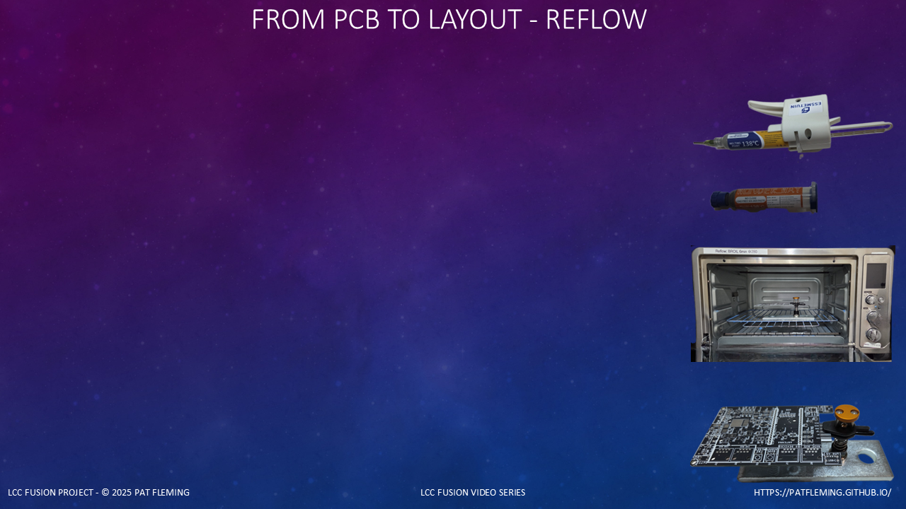
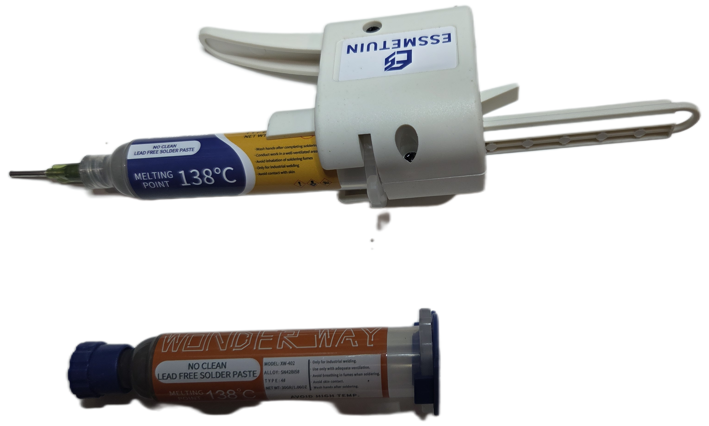
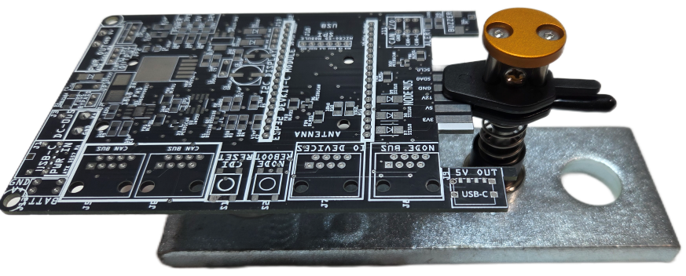

<!--
YOUTUBE DESCRIPTION

In this video, I share how I learned to use an affordable reflow process
to assemble LCC Fusion PCBs with consistent, professional results.

We compare stencils and automatic solder paste dispensers, explain how
Fusion tooling holes provide accurate stencil alignment without framed
stencils or an expensive alignment jig, and show why a digital countertop
oven makes DIY reflow practical without a commercial reflow oven.

Related video - Fusion PCB Tooling Holes and Stencil Alignment:
[Add YouTube URL]

LCC Fusion Project Documentation:
https://tinyurl.com/LccFusionDoc

AI-Assisted Production Notice:
This video uses AI-generated narration based on the author's guidance,
experience, and technical material.
This approach ensures the information is clear, consistent, and easy to
update as the LCC Fusion Project evolves.
All technical content and project decisions are fully human-authored.
-->

<!-- ===================================================== -->
<!-- Scene 1: Reflow — Concept & Benefits                  -->
<!-- ===================================================== -->

(font-size: 20)



```md
# Reflow — Concept
* Reflow secures components using solder paste and heat
* All **SMD** parts are soldered in a single step
* Reflow can also **tack PTH parts** during the same cycle
* Uses **low-melt T4 solder paste with a 138 °C melting point**

# Terminology
* **SMD** – Surface Mount Device
* **PTH** – Plated Through-Hole
* **PCB** – Printed Circuit Board
```
> Reflow = solder paste + oven (not hand soldering)

Before we touch solder paste, I want to define what “reflow” means
and how we use it to build LCC Fusion PCBs.

(pause: 0.6)

When I first considered using reflow
to assemble LCC Fusion PCBs,
I expected the process to be difficult and expensive.
I was new to reflow and SMD soldering,
so I needed a method that did not require professional equipment
or years of reflow experience.

(pause: 0.6)

After discovering and refining this reflow method,
I found that DIY soldering was much easier than I expected.
With an affordable setup and a repeatable process,
I could produce consistent, professional results.

(pause: 0.8)

Reflow is simply melting solder paste to secure components to the PCB,
all at once—so you’re not hand-soldering every tiny pad individually.

(pause: 0.8)

> Low-melt paste protects the PCB

For LCC Fusion, we recommend a low-melt T4 solder paste,
commonly sold in syringes.
Specifically, use a paste with a melting point of 138 degrees Celsius,
or 280 degrees Fahrenheit,
which helps prevent PCB discoloration during the process.

(pause: 0.8)

> Reflow also tacks PTH parts in place

A key benefit shown throughout this video series is that reflow is normally used for SMD parts,
but it can also be used to lightly tack PTH parts in place.
This tacking step holds those parts securely for inspection.
In many cases, the reflowed PTH connection is sufficient
and does not require additional hand soldering.
Hand solder only the connections that inspection shows are incomplete
or need correction.

That’s the core idea behind reflow.

(pause: 0.6)

---

<!-- ===================================================== -->
<!-- Scene: Why Fusion Uses Reflow -->
<!-- ===================================================== -->

(font-size: 20)


```md
# Why Fusion Uses Reflow
* Fusion is designed for DIY electronics
* Builders assemble the PCBs themselves
* DIY reflow is practical and affordable
* Avoids the higher cost of fully assembled boards
* Fastest and most accurate way to solder SMD parts
* The same process works across Fusion PCBs
```

> Reflow supports Fusion's DIY and low-cost goals

One of the main goals of LCC Fusion
is to make layout automation practical for people who build their own electronics.

(pause: 0.6)

Fusion builders start with PCBs and electronic components
rather than purchasing fully assembled boards.
That keeps the hardware cost lower,
but it also means soldering is part of the build process.

(pause: 0.6)

Reflow may initially appear difficult or require expensive equipment,
but the Fusion process is designed to make it practical for DIY builders.
The basic tools can be reused across many boards,
and the process is not difficult once the steps are understood.

(pause: 0.6)

Hand-soldering every small surface-mount pad would make these boards
much more difficult and time-consuming to assemble.

(pause: 0.6)

Reflow solders all the SMD components in one heating cycle.
For Fusion PCBs, it is the fastest and most accurate way
to solder the surface-mount components.

(pause: 0.6)

The solder paste can be applied with a stencil
or placed directly on individual pads with a solder paste dispenser.
Either method controls the location and volume of the paste,
and the reflow cycle solders all the SMD joints at once.
It provides a repeatable process that can be used
across the different LCC Fusion PCBs.

(pause: 0.6)

This makes reflow a good fit for Fusion:
DIY assembly, low equipment cost, and consistent results.

(pause: 0.6)

---

<!-- ===================================================== -->
<!-- Scene: Applying Solder Paste -->
<!-- ===================================================== -->

(font-size: 20)



```md
# Applying Solder Paste
* Stencil - fastest and most accurate for SMD pads
* Tooling holes avoid framed stencils and an alignment jig
* About $20 per PCB type for the stencil and shipping
* Automatic dispenser - about $120 one-time equipment cost
* Dispenser is helpful when adding paste for PTH reflow
* Automatic dispensing reduces hand fatigue
* Small IC pads are the most difficult to dispense accurately
```

> Solder paste can be applied with a stencil or a dispenser

A stencil is the fastest and most accurate way
to apply a consistent amount of solder paste across the SMD pads on a PCB.
This is especially important for integrated circuits with small pads.
The stencil applies paste to the SMD pads, not the PTH connections.

(pause: 0.6)

Fusion PCBs include tooling holes designed for stencil alignment.
Matching holes in the PCB and stencil allow alignment pins
to register the stencil accurately over the SMD pads.
This replaces the traditional approach
of mounting each stencil in a frame
and using a separate stencil alignment jig.
The tooling holes make stencil application repeatable
without the added cost of framed stencils or the jig.
A separate reference video covers the tooling-hole method in detail.

(pause: 0.6)

The tradeoff is cost.
Having a stencil made and shipped costs about 20 dollars for each PCB type.
Because LCC Fusion includes many different PCB types,
those individual stencil costs can add up.

(pause: 0.6)

An automatic solder paste dispenser is another option.
The equipment has a one-time cost of about 120 dollars
and can be reused across the different Fusion PCB types.

(pause: 0.6)

The dispenser is also very helpful
when solder paste must be added for PTH reflow.
A stencil applies paste to the SMD pads,
while the dispenser allows paste to be added
where it is needed for the PTH components.

(pause: 0.6)

Dispensing paste by hand can cause hand fatigue,
even when using a lever-action hand dispenser.
An automatic dispenser supplies the pressure
and makes repeated paste placement easier.

(pause: 0.6)

The automatic dispenser is relatively fast,
but it is more difficult to use than a stencil.
It takes practice to control the amount of paste placed on each pad,
especially for integrated circuits with small pads.

(pause: 0.6)

The right choice depends on how many PCB types and boards you plan to build.
A stencil provides the best speed and accuracy for a specific PCB,
while an automatic dispenser avoids buying a separate stencil
for every PCB type.

(pause: 0.6)

Both methods prepare the PCB for the same component-placement
and reflow process.

(pause: 0.6)

---

<!-- ===================================================== -->
<!-- Scene: Choosing a Reflow Method -->
<!-- ===================================================== -->

(font-size: 20)


```md
# Choosing a Reflow Method
* Covered hot plate — difficult to monitor
* Commercial reflow oven — often costs more than $1,000
* DIY reflow oven — requires significant work
* Digital countertop oven — low cost and easy to use
* Reflow multiple PCBs at once
```

> Several methods work, but they do not offer the same tradeoffs

A covered hot plate can be used for reflow,
but I have had limited success with that method.

(pause: 0.6)

It normally handles only one PCB at a time,
and monitoring the board temperature is difficult.

(pause: 0.6)

Commercial reflow ovens are designed for the job,
but many cost more than one thousand dollars.
That is a significant expense for a DIY builder
or a hobby-scale project.

(pause: 0.6)

A DIY reflow oven is another option,
but building and setting it up requires significant time and work.

(pause: 0.6)

For LCC Fusion, a small digital countertop oven provides the right balance.
It is inexpensive, easy to use, and can reflow multiple PCBs at once.

(pause: 0.6)

That combination meets the needs of the Fusion project
without requiring specialized or custom-built equipment.

(pause: 0.6)

---

<!-- ===================================================== --> 
<!-- Scene 2: Reflow — Execution & Constraints --> 
<!-- ===================================================== -->

(font-size: 20)


 
```md
# Reflow — Execution
* Small digital countertop oven
* Dedicated to electronics — never used for food
* Use in a well-ventilated workspace
* Oven set to **BROIL** (top heat)
* Control by **oven temperature**
* Stop at **280 °F (138 °C)**, then slow cool
```

Now let’s talk about how we actually perform the reflow step.

(pause: 0.6)

> Use a dedicated oven in a well-ventilated workspace

Use an oven dedicated to electronics.
Never use it for food preparation.
Operate it in a well-ventilated workspace.

(pause: 0.8)

> Control by oven temperature — not by watching solder melt
> Turn oven off at 280 °F, then open door

For heating, we use a small digital countertop oven.
We run the oven in BROIL mode so heat is applied from the top of the PCB.

(pause: 0.8)

Here’s the critical control rule:
we don’t time this by watching the solder melt.
We heat until the oven display reaches 280 degrees Fahrenheit,
then turn the oven off and open the door for a slow cool-down.

(pause: 0.8)

This produces consistent, repeatable reflow.
Multiple PCBs can be reflowed at once.

(pause: 0.8)

---

<!-- ===================================================== -->
<!-- Scene: Supporting the PCB -->
<!-- ===================================================== -->

(font-size: 20)



```md
# Supporting the PCB
* Suspend the PCB when PTH components are installed
* Keep PTH leads off the oven rack
* Use an all-metal PCB support
* CLAMPREX Helping Hands is one option
* Center SMD-only PCBs on the oven rack
```

> PCB support depends on the components installed during reflow

When PTH components are installed before reflow,
their leads extend below the PCB.
The board must be suspended so those leads do not touch the oven rack.

(pause: 0.6)

Suspending the PCB allows the PTH components
to be lightly tacked during the same reflow cycle as the SMD parts.

(pause: 0.6)

CLAMPREX Helping Hands is one way to suspend the PCB,
but other PCB holders and supports can also be used.
Whatever support you choose must be made entirely of metal
so it can safely withstand the oven's heat.

(pause: 0.6)

If no PTH components are installed during reflow,
the PCB does not need to be suspended.
Place the PCB, or multiple PCBs, directly on the oven rack
and center them in the oven.

(pause: 0.6)

---

<!-- ===================================================== -->
<!-- Scene: Optional Oven Verification -->
<!-- ===================================================== -->

(font-size: 20)


```md
# Optional Oven Verification
* Place a digital temperature probe near the PCB
* Monitor the complete heating cycle
* Confirm the temperature reaches **280 °F**
* Compare with the solder supplier's reflow profile
```

> Verify an unfamiliar oven before relying on its display

If you are unsure whether the oven temperature display is accurate,
you can verify the heating cycle with a digital temperature probe
positioned near the PCB.

(pause: 0.6)

Monitor the temperature throughout the heating cycle
and confirm that it reaches 280 degrees Fahrenheit.

(pause: 0.6)

I also compare the measured heating curve
with the reflow profile recommended by the solder supplier.

(pause: 0.6)

This is useful when setting up or troubleshooting an oven.
Once the oven's behavior is understood,
a probe is not required for every batch.

(pause: 0.6)

---

<!-- ===================================================== -->
<!-- Scene: Reflow Summary -->
<!-- ===================================================== -->

(font-size: 20)


```md
# Reflow Summary
* Apply paste with a stencil or dispenser
* Use low-melt T4 paste: **138 °C (280 °F)**
* Reuse affordable equipment across many PCB builds
* Use a dedicated oven in a ventilated workspace
* Suspend PCBs when PTH components are installed
* Center SMD-only PCBs on the oven rack
* Control the process by oven temperature
* Turn off at **280 °F**, then allow a slow cool-down
```

> A consistent process produces repeatable results

Reflow is straightforward when the paste, oven, PCB support,
and temperature control are handled consistently.

(pause: 0.6)

The next video covers the soldering techniques used to inspect joints,
correct problems, and finish the through-hole connections after reflow.

(pause: 0.6)

