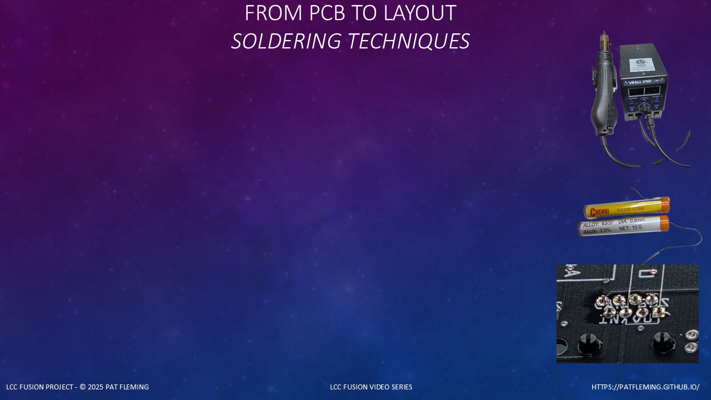

<!-- ========================================================= -->

<!-- Scene — Purpose and Scope                                 -->

<!-- ========================================================= -->


(font-size: 20)





```md

# Soldering Techniques

* Reusable across all PCB builds

* Focused on problem-solving, not assembly steps

```


> Soldering techniques used throughout LCC Fusion


When I began building LCC Fusion PCBs,

I was new to soldering both SMD and PTH components.

I expected small pads, raised pins, and solder bridges

to make DIY assembly difficult.


(pause: 0.6)


I learned that most soldering problems can be found during inspection

and corrected with a few repeatable techniques.

That made DIY soldering less intimidating

and helped me produce consistent, professional results.


(pause: 0.6)


This video focuses on soldering techniques that apply across

multiple LCC Fusion PCB builds.


(pause: 0.6)


These techniques are referenced by the Node Card, PWM Card,

and other build videos,

so they are covered once here in detail.


(pause: 0.6)


---


<!-- ========================================================= -->

<!-- Scene — Tools That Matter                               -->

<!-- ========================================================= -->


(font-size: 20)


```md

# Essential Soldering Tools

* Temperature-controlled soldering station

* Oblique Horseshoe soldering tip

* Hot air rework gun

* Flux (optional)

```


> Use the right tools for predictable results


Good soldering results depend more on the right tools

than on hand skill.


(pause: 0.6)


> Use an Oblique Horseshoe soldering tip


A temperature-controlled soldering station

with an Oblique Horseshoe soldering tip

is strongly recommended.


(pause: 0.6)


The Oblique Horseshoe tip holds solder well,

allows precise contact,

and is ideal for both pin soldering

and removing solder bridges.


(pause: 0.6)


A hot air gun is used for post-reflow SMD correction and reseating,

not for initial component placement.


(pause: 0.6)


---


<!-- ========================================================= -->

<!-- Scene — Preparing IC Legs Before Placement                          -->

<!-- ========================================================= -->


(font-size: 20)


```md

# Preparing IC Legs

* Flatten before placement

* Align before pasting

``` 


> IC legs often need adjustment


IC legs are often bent during shipping or handling,

especially the corner pins.


(pause: 0.6)


Before placement,

set the IC on a flat, hard surface

and gently press down

to flatten all legs evenly.


(pause: 0.6)


> Use an X-Acto knife for alignment


Use a No. 11 X-Acto knife

to align any pins that are out of parallel.


(pause: 0.6)


If this step is skipped,

pins may not seat into the solder paste

and will cause reflow defects.


(pause: 0.6)


---


<!-- ========================================================= -->

<!-- Scene — PTH Soldering Methods                        -->

<!-- ========================================================= -->


(font-size: 20)


```md

# PTH Soldering Methods

* Optional PTH tacking during reflow

* Traditional PTH hand soldering

* Inspect and correct either method

```


> Two methods can be used with PTH components


LCC Fusion uses two techniques

for working with PTH components.


(pause: 0.6)


The first technique is optional PTH tacking during reflow.

PTH components are installed before the reflow cycle

and held in alignment by solder paste as it melts.


(pause: 0.6)


The second technique is traditional PTH hand soldering.

The component is seated and each pin is soldered

using a soldering iron and solder wire.


(pause: 0.6)


Both methods require inspection,

and the same correction techniques can be used

if a component shifts or a solder bridge forms.


(pause: 0.6)


---


<!-- ========================================================= -->

<!-- Scene — Optional PTH Tacking During Reflow                        -->

<!-- ========================================================= -->


(font-size: 20)


```md

# PTH Tacking During Reflow

* Optional technique

* Avoid holding parts while the PCB is flipped

* Add paste with a dispenser

* Suspend the PCB above the oven rack

* Reflow with the SMD components

* Hand solder only when inspection shows it is needed

```


> Reflow can hold PTH components in alignment


For optional PTH tacking during reflow,

install the PTH components before placing the PCB in the oven.


(pause: 0.6)


Without tacking,

the component must be held against the PCB

while the board is flipped over for soldering from underneath.

Common approaches include holding the component with a finger,

resting it against a surface,

using temporary tack putty,

or bending the component leads.


(pause: 0.6)


Each approach adds handling

and can make it harder to keep the component straight and fully seated.

Because the PCB is already going through reflow,

adding paste to the PTH connections

is often faster and simpler.


(pause: 0.6)


Use a solder paste dispenser

to add paste where it is needed for the PTH connections.

Because the component leads extend below the PCB,

suspend the board with an all-metal PCB support

so the leads do not touch the oven rack.


(pause: 0.6)


During the same heating cycle used for the SMD components,

the paste melts and tacks the PTH components in alignment.

After the PCB cools,

inspect the component position and every tacked connection.


(pause: 0.6)


In many cases,

the reflowed connection has sufficient solder coverage and wetting,

so additional hand soldering is not needed.

Hand solder only the connections

that inspection shows are incomplete or need correction.


(pause: 0.6)


---


<!-- ========================================================= -->

<!-- Scene — Inspecting After Reflow                              -->

<!-- ========================================================= -->


(font-size: 20)


```md

# Post-Reflow Inspection

* Check component seating

* Check component alignment

* Check component pad wetting

* Look for raised component pins and solder bridges

* Correct component problems before PTH soldering

```


> Inspect before touching the soldering iron


After reflow, always inspect the board

before soldering any pins.


(pause: 0.6)


Allow the PCB to cool,

then inspect the SMD components under magnification.

Check that each component is centered over its pads,

seated flat against the PCB,

and facing the correct direction.


(pause: 0.6)


Confirm that all SMD parts are seated flat,

pads are properly wetted,

and there are no raised pins or solder bridges.


(pause: 0.6)


If an SMD component is misaligned,

use a hot air gun with low airflow

to reheat the solder around the component.

Once the solder melts,

gently tap or nudge the component into the correct alignment

using a heat-safe tool.


(pause: 0.6)


Remove the heat and keep the component still

until the solder solidifies.

Reinspect the component before moving on.


(pause: 0.6)


Reflow completes the soldering step,

but inspection confirms its quality.


(pause: 0.6)


---


<!-- ========================================================= -->

<!-- Scene — Reseating Raised or Misaligned SMD Pins                             -->

<!-- ========================================================= -->


(font-size: 20)


```md

# Reseating SMD Pins

* Use a soldering tip or hot air

* Press straight down

```


> Fix raised pins immediately


Occasionally, an SMD pin may not fully contact the pad

after reflow.


(pause: 0.6)


> Heat and press the pin down into the solder


To fix this, place a hot soldering tip

directly on the pin and pad,

allow the solder to melt,

and press straight down on the pin.


(pause: 0.6)


The pin will settle into the solder

and form a proper joint.


(pause: 0.6)


---


<!-- ========================================================= -->

<!-- Scene — Removing Solder Bridges on ICs                            -->

<!-- ========================================================= -->


(font-size: 20)


```md

# Removing Solder Bridges

* Oblique Horseshoe tip required

* Clean tip frequently

```


> Solder bridges are common—and fixable


Solder bridges are most common

on fine-pitch ICs.


(pause: 0.6)


The preferred removal method

is to use a hot Oblique Horseshoe soldering tip.


(pause: 0.6)


> Pull solder away from the IC


Place the tip against the bridge,

allow the solder to melt,

then pull the solder away from the IC

onto the tip.


(pause: 0.6)


> Clean the tip each time


Clean the tip immediately,

then repeat if needed.


(pause: 0.6)


Do not drag solder across pins—

always pull away from the component.


(pause: 0.6)


---


<!-- ========================================================= -->

<!-- Scene — Traditional PTH Hand Soldering                        -->

<!-- ========================================================= -->


(font-size: 20)


```md

# Traditional PTH Hand Soldering

* Heat the pin and pad together

* Apply solder wire to the heated connection

* Draw solder up the lead

```


> Traditional PTH soldering uses an iron and solder wire


For traditional PTH hand soldering,

place the Oblique Horseshoe tip at roughly a 45-degree angle

so it contacts both the pin and the plated ring.


(pause: 0.6)


Heat the pin and pad together,

then apply solder wire to the heated connection.

Remove the solder wire once enough solder has flowed.


(pause: 0.6)


As the solder melts,

pull the tip slightly upward

to draw solder from the ring

up along the pin.


(pause: 0.6)


Let the joint cool without moving the component.

This creates a strong,

clean joint with good wetting.


(pause: 0.6)


---


<!-- ========================================================= -->

<!-- Scene — Fixing PTH Issues                        -->

<!-- ========================================================= -->


(font-size: 20)


```md

# PTH Corrections

* Reseat parts

* Remove bridges

```


> Fix issues before trimming leads


If a PTH component is not seated flush,

heat one pin and gently press the part down

until it contacts the PCB surface.


(pause: 0.6)


If solder bridges form between pins,

use the Oblique Horseshoe tip to pull excess solder away,

cleaning the tip after each pass over the pins.


(pause: 0.6)


Trim component leads only

after all solder joints are complete and verified.


(pause: 0.6)


---


<!-- ========================================================= -->

<!-- Scene — Final Cleanup and Verification                    -->

<!-- ========================================================= -->


(font-size: 20)


```md

# Final Cleanup

* Inspect every joint

* Optional cleaning

```


> Finish with inspection, not assumptions


After soldering,

inspect every pin and pad.


(pause: 0.6)


Confirm there are no cold joints,

no missed pins,

and no solder bridges.


(pause: 0.6)


Because LCC Fusion uses no-clean solder paste,

flux residue is minimal.


(pause: 0.6)


> Clean with alcohol or electrical contact cleaner


If desired,

use alcohol or electrical contact cleaner and a soft brush,

then allow the board to air dry.


(pause: 0.6)


Do not wipe with cloths—

they snag components and leave residue.


(pause: 0.6)


---


<!-- ========================================================= -->

<!-- Scene — Closing                   -->

<!-- ========================================================= -->


(font-size: 20)


```md

# Technique Matters

* Repeatable

* Fixable

* Reusable

```


> These techniques apply everywhere


These soldering techniques apply

across all LCC Fusion PCB builds.


(pause: 0.6)


Build videos reference these techniques

so they can stay focused

on assembly flow, not soldering mechanics.


(pause: 0.6)


With soldering covered,

we can now focus entirely

on building and configuring the system.


(pause: 0.6)

