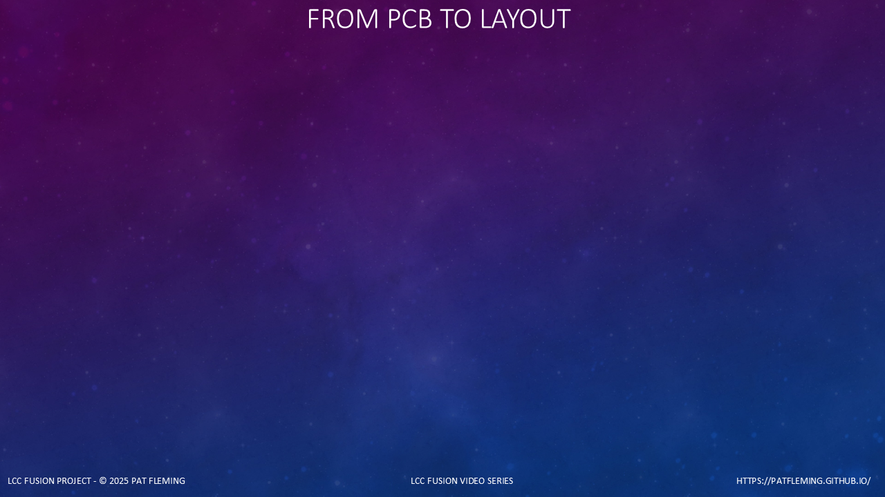

<!--
YOUTUBE DESCRIPTION

Build your LCC Fusion CTC Panel:
https://tinyurl.com/LccFusionCTC

In this episode of From PCB to Layout, I show how LCC Fusion brings
together a Digital 64 I/O Board, a customizable 3D-printed CTC panel,
reduced field wiring, LCC Event IDs, and layout automation.

The Half Siding example follows the complete path from the PCB to an
operating panel with turnout controls, signals, and block indicators. It
also shows how LCC Event IDs let multiple Fusion boards work together.

Related video - Building LCC Fusion I/O Cards:
[Add YouTube URL]

LCC Fusion CTC Planning Guide:
https://tinyurl.com/LccFusionCTC

LCC Fusion CTC Panel Assembly Guide:
[Add guide URL]

LCC Fusion CTC Panel Installation Guide:
[Add guide URL]

LCC Fusion Digital 64 I/O Board Assembly Guide:
[Add guide URL]

LCC Fusion OpenSCAD and Customizer Guide:
[Add guide URL]

LCC Fusion Project Documentation:
https://tinyurl.com/LccFusionDoc

AI-Assisted Production Notice:
This video uses AI-generated narration based on the author's guidance,
experience, and technical material.
This approach ensures the information is clear, consistent, and easy to
update as the LCC Fusion Project evolves.
All technical content and project decisions are fully human-authored.
-->

<!-- ===================================================== -->
<!-- Scene: Introduction -->
<!-- Visual review: Replace the series background with the finished Half Siding panel. -->
<!-- ===================================================== -->

(font-size: 20)



```md
# From PCB to a CTC Panel
* One complete Fusion solution
* Custom panel and controls
* LCC integration
* Reduced field wiring
```

> Start with a PCB and end with an operating CTC panel

In this episode of From PCB to Layout, I am going to show how LCC Fusion
can take us from a printed circuit board to a complete CTC panel.

(pause: 0.6)

When I started planning this project, I did not want to treat the panel,
the electronics, the wiring, and the layout automation as separate
projects.

I wanted one practical path that a model railroader could customize for
a specific control point.

(pause: 0.6)

The result brings together a Digital 64 I/O Board, printable panel parts,
short local wiring, LCC Event IDs, and the Fusion devices already
controlling the layout.

(pause: 0.6)

This is LCC Fusion: Modern Layout Automation, carried all the way from
the PCB to layout operation.

(pause: 0.6)

---

<!-- ===================================================== -->
<!-- Scene: What the Panel Represents -->
<!-- Visual review: Use a labeled track diagram or the Half Siding planning view. -->
<!-- ===================================================== -->

(font-size: 20)


```md
# Start With the Railroad
* Control point
* Track diagram
* Turnout and signal controls
* Confirmed layout status
```

> The panel represents a real operating location

Before designing the panel, I first decide what part of the railroad it
represents.

A CTC panel may cover one control point, several related control points,
or a larger interlocking.

(pause: 0.6)

The track diagram gives the operator a simplified view of the main
track, sidings, turnouts, controlled blocks, and signals.

Below the diagram, traditional lever face plates can provide turnout and
signal controls. For a more compact panel, a turnout switch can be
mounted directly in the diagram.

(pause: 0.6)

The important distinction is that a control makes a request, while the
panel indicators show confirmed layout status.

That keeps the panel tied to what the railroad actually did, not just to
the position of a switch.

(pause: 0.6)

---

<!-- ===================================================== -->
<!-- Scene: Digital 64 I/O Board -->
<!-- Visual review: Show the Digital 64 I/O Board PCB and its connectors. -->
<!-- ===================================================== -->

(font-size: 20)


```md
# Digital 64 I/O Board
* 64 configurable lines
* Inputs for controls
* Outputs for indicators
* One Node Bus connection
```

> One board handles the panel inputs and outputs

The electronic center of the panel is the Fusion Digital 64 I/O Board.

Its sixty-four lines can be configured individually as inputs or
outputs.

(pause: 0.6)

Inputs read turnout levers, signal levers, and command buttons.

Outputs operate block, turnout-position, and signal indicators.

(pause: 0.6)

Instead of running separate long wires from every panel device to the
layout, I can mount the board behind the panel and keep those individual
wires short.

One Node Bus Cable then connects the panel electronics to the Node Card
and the rest of the Fusion system.

(pause: 0.6)

One Digital 64 I/O Board can serve a large panel or several nearby
panels. The Node Card firmware can support as many as four of these
boards when an installation needs more capacity.

(pause: 0.6)

---

<!-- ===================================================== -->
<!-- Scene: Fusion Architecture -->
<!-- Visual review: Use the CTC planning guide architecture diagram. -->
<!-- ===================================================== -->

(font-size: 20)


```md
# One Event-Based System
* Panel controls make requests
* LCC carries Event IDs
* Fusion devices operate the layout
* Confirmed events update the panel
```

> Requests go out and confirmed status comes back

The Digital 64 I/O Board does not require a special CTC protocol.

It uses the same LCC Event IDs as the rest of the layout.

(pause: 0.6)

When I move a turnout lever, the input line produces a Normal or Reverse
request Event ID.

The turnout hardware and any required Node Card Logics decide how that
request is handled.

(pause: 0.6)

Once the turnout reaches its position, its confirmed Normal or Reverse
event drives the corresponding panel indicator.

Block detection and signal hardware work the same way. Their status
events operate the LEDs on the CTC panel.

(pause: 0.6)

This event-based connection is what turns the panel into part of the
layout automation rather than a separate collection of switches and
lamps.

(pause: 0.6)

---

<!-- ===================================================== -->
<!-- Scene: Multiple Fusion Boards Working Together -->
<!-- Visual review: Create a Mermaid-derived diagram with LCC Event IDs -->
<!-- in the center and the CTC, BOD, Turnout, and Signal boards around it. -->
<!-- ===================================================== -->

(font-size: 20)


```md
# LCC Events Connect the Boards
* BOD Card reports occupancy
* Turnout Card controls and confirms position
* Signal Card controls signal aspects
* Digital 64 I/O Board operates the panel
* Other LCC controls can share the events
```

> Multiple Fusion boards cooperate through shared LCC events

This is one of the most important differences in the Fusion CTC
solution.

The CTC panel is not wired directly to every turnout, block detector,
and signal on the layout.

(pause: 0.6)

It also does not depend on one large, CTC-specific circuit board with
dedicated connections and all of the operating logic built into one
controller.

(pause: 0.6)

Instead, each Fusion board performs its own job.

The BOD Card reports block occupancy. The Turnout Card accepts turnout
requests and reports confirmed position. The Signal Card controls the
signal aspects. The Digital 64 I/O Board handles the switches, buttons,
and LEDs on the CTC panel.

(pause: 0.6)

LCC Event IDs let all of these boards work together, even when they are
installed at different locations around the layout.

Node Card Logics can use those same events to check occupancy, turnout
position, route conflicts, and other conditions before an action is
accepted.

(pause: 0.6)

The result is distributed layout control. Each board remains reusable,
and the CTC panel becomes another participant in the same event-based
system.

(pause: 0.6)

The panel also does not have to be the only place where a turnout or
signal is controlled or indicated.

The same Event IDs can be used by local fascia controls, another CTC
panel, layout automation, JMRI, or other LCC-compatible devices.

(pause: 0.6)

That flexibility allows controls and indicators to be placed where they
are useful without adding another dedicated wire back to the CTC panel.

(pause: 0.6)

---

<!-- ===================================================== -->
<!-- Scene: Open-Source Printable Panel System -->
<!-- Visual review: Show the CTC panel OpenSCAD assembled view and several parts. -->
<!-- ===================================================== -->

(font-size: 20)


```md
# Open-Source 3D Panel System
* OpenSCAD source included
* Panels, segments, controls, and labels
* Multi-color face plate parts
* Alignment and drill guides
```

> The printable design is part of the Fusion project

The physical CTC panel is not just a collection of finished STL files.
Its OpenSCAD source is included with the open-source Fusion project.

(pause: 0.6)

The design includes panels, bezels, track segments, face plates, control
levers, labels, drill guides, and network cable guides.

(pause: 0.6)

Segments can include block, turnout-position, and signal indicators or
a turnout switch. Raised bezels finish the LED openings.

Face plates offer blank, cutout, and bezel styles. Separate blank and
bezel parts support traditional two-color lettering and outlines.

(pause: 0.6)

I have become especially interested in multi-color 3D printing as
printers have made it much easier to use. The separate face plate,
lever, bezel, and text parts let color become part of the CTC design
instead of requiring paint or engraved labels after printing.

(pause: 0.6)

Optional panel grooves and segment pins keep track rows aligned during
gluing. Face plates use alignment posts and matching panel holes.

(pause: 0.6)

Matching drill guides position block, signal, and turnout-indicator
holes through the panel.

(pause: 0.6)

Together, these assets form a coordinated panel-building system.

(pause: 0.6)

---

<!-- ===================================================== -->
<!-- Scene: Quick Start and Customization -->
<!-- Visual review: Show a supplied 3MF in CrealityPrint, multiple project -->
<!-- plates, print-ready part orientation, and the OpenSCAD Customizer. -->
<!-- ===================================================== -->

(font-size: 20)


```md
# Quick Start or Customize
* Prepackaged 3MF files
* Parts oriented for printing
* Organize parts on multiple slicer plates
* Change exact dimensions in OpenSCAD
* Build coordinated custom part sets
```

> Start with supplied parts and customize only what is needed

For a quick start, Fusion provides prepackaged 3MF files for
diagram-only panels, separate lever areas, controls in the diagram, and
both Half Siding examples.

(pause: 0.6)

The supplied parts are already oriented for printing. In CrealityPrint,
I can remove, duplicate, arrange, and color them without first turning
each model onto the correct face.

(pause: 0.6)

One CrealityPrint project can contain multiple build plates. I can sort
the panel, track segments, face plates, labels, and other parts into
print groups while keeping everything for one CTC panel together.

An extra plate can hold supplied parts that I am not currently using,
so they remain available without being included in the next print.

(pause: 0.6)

When supplied sizes do not match the track plan, the OpenSCAD Customizer
changes the parts without requiring the user to rewrite the model.

Panel width, rows, columns, thickness, mounting holes, dimmer opening,
text, control numbers, and alignment can all be selected.

(pause: 0.6)

Segment dimensions, end shape, switch and indicator holes, and indicator
counts can be changed independently. Face plates, levers, and labels are
also customizable.

(pause: 0.6)

This preserves precision switch and LED holes instead of scaling them
with the complete part. Advanced users can also build coordinated STL
and 3MF sets from the supplied user manifest.

(pause: 0.6)

---

<!-- ===================================================== -->
<!-- Scene: Half Siding Slicer Project -->
<!-- Visual review: Walk through the Half Siding CrealityPrint project -->
<!-- and show each color or part-group plate. -->
<!-- ===================================================== -->

(font-size: 20)


```md
# Half Siding Slicer Project
* White track segments
* Black panel and face plates
* Colored control levers
* Colored face plate bezels and text
* Automatic CFS filament selection
* Unused parts plate
```

> One CTC panel project organized across multiple build plates

For the Half Siding, I can keep the complete print job in one
CrealityPrint project while separating the parts by color and purpose.

(pause: 0.6)

One plate can hold the white track segments. A black plate can hold the
panel and the black face plates.

Separate color plates can hold the control levers and the matching
bezel-and-text parts. For example, the turnout control can use white
accents while the signal control uses yellow accents.

(pause: 0.6)

With the Creality K2 Plus, as many as four CFS units can make up to
sixteen filament colors available. Once each part has its color assigned
in the project, I can select a plate and print it with the matching
filament automatically fed by the CFS.

Then I move to the next plate, where its part colors are already saved
and ready to print.

(pause: 0.6)

Another plate can retain unused parts from the supplied 3MF. When I need
one later, I can copy it onto the appropriate color plate without
returning to the original package.

(pause: 0.6)

This keeps the complete Half Siding print organized as one project while
still allowing each plate to be prepared and printed independently.

(pause: 0.6)

---

<!-- ===================================================== -->
<!-- Scene: Plan Before Printing -->
<!-- Visual review: Show a paper sketch beside the matching rendered panel. -->
<!-- ===================================================== -->

(font-size: 20)


```md
# Plan Before Printing
* Draw the track diagram
* Choose control locations
* Count indicators and LEDs
* Select or customize the parts
```

> Make the operating decisions before making the panel

The process starts with a simple drawing.

I identify the blocks, turnouts, signals, control points, and the
direction of operation.

(pause: 0.6)

Next, I decide whether turnout controls belong in the track diagram or
in a separate lever area.

I also decide which confirmed indications the operator needs to see and
whether each indication uses separate LEDs or a bi-color or tri-color
LED.

(pause: 0.6)

From that drawing, I can determine the segment types and lengths, panel
rows, control columns, switch-hole sizes, and indicator-hole sizes.

Then I can select the closest supplied 3MF package or customize the
individual parts in OpenSCAD.

(pause: 0.6)

The detailed planning and assembly guides contain the option tables and
step-by-step procedures. The video is intended to show how those pieces
form one complete workflow.

(pause: 0.6)

---

<!-- ===================================================== -->
<!-- Scene: Half Siding Example -->
<!-- Visual review: Show both Half Siding panel configurations. -->
<!-- ===================================================== -->

(font-size: 20)


```md
# Half Siding Example
* Four detected blocks
* One turnout
* Two signals
* 24 I/O lines
```

> A small example shows the complete system

The Half Siding is the first complete Fusion CTC example.

It is intentionally small enough to understand at one glance, but it
contains the major parts of a working panel.

(pause: 0.6)

The diagram includes four detected blocks, one turnout, a double-head
signal at the turnout, and a three-lamp signal beyond it.

The lever version adds a turnout control, a signal control, and a code
button below the track diagram.

(pause: 0.6)

That configuration uses nineteen output lines for the LEDs and five
input lines for the controls, for a total of twenty-four I/O lines.

(pause: 0.6)

There is also a compact version with the turnout control mounted directly
in the diagram and no separate lever area.

Both versions demonstrate that the same operating location can be
packaged differently without changing the underlying LCC event plan.

(pause: 0.6)

---

<!-- ===================================================== -->
<!-- Scene: Physical Installation -->
<!-- Visual review: Show the back of the panel, board mounting, and cable guides. -->
<!-- ===================================================== -->

(font-size: 20)


```md
# Complete the Physical Panel
* Print and arrange the parts
* Use a printed, wood, or acrylic panel
* Use the indicator drill-guide parts
* Install controls and LEDs
* Include the board mounting holes
```

> Keep the panel wiring short and serviceable

After the panel parts are printed, I arrange the track segments and
labels before attaching them.

The track segments, face plates, labels, and guides can be used with the
supplied 3D-printed panel or attached to a builder-supplied wood or
acrylic panel.

(pause: 0.6)

Separate drill-guide parts fit over the block, signal, and
turnout-position indicator features. They transfer the complete hole
patterns through the panel without aligning every opening by
measurement.

(pause: 0.6)

The controls and LEDs install from the appropriate side of the panel,
and the face plates align with the holes already generated in the panel.

(pause: 0.6)

The panel Customizer can also include the four fixed mounting holes for
the Digital 64 I/O Board. The board then mounts directly on the back
using M3 standoffs, with clearance for the switches, terminals, and
removable connectors.

Network cable guides help route the board cables without sharp bends.

(pause: 0.6)

Prewired LEDs and small pluggable wire connectors can make the wiring
removable and easier to change during testing.

The goal is a practical installation without soldering every panel
connection or using twisted wire caps.

(pause: 0.6)

---

<!-- ===================================================== -->
<!-- Scene: Wiring and Configuration -->
<!-- Visual review: Show one breakout connector and a short line-assignment table. -->
<!-- ===================================================== -->

(font-size: 20)


```md
# From Wires to Event IDs
* Network patch-cable pigtails
* Low-cost 2-position connectors
* Prewired LEDs
* Label each board line
* Record the panel device
* No-solder, removable wiring
```

> One worksheet connects installation and configuration

The installation guide uses a line-assignment worksheet to connect the
physical wiring with the LCC configuration.

Each connection receives a name such as J one, pin one.

(pause: 0.6)

Short network patch cables can plug into the Digital 64 I/O Board. The
plug is removed from the panel end, leaving eight color-coded conductors
that become labeled pigtails.

Low-cost two-position wire connectors join those conductors to prewired
LEDs, switches, and buttons.

(pause: 0.6)

This makes panel assembly fast and avoids soldering the field
connections. During testing or a later panel change, a wire can be
released and moved without cutting apart a permanent splice.

(pause: 0.6)

For that line, I record the CTC panel device, the related layout-device
name and reference ID, and the Event IDs it produces or consumes.

This gives the installer and the configuration person the same
line-by-line reference.

(pause: 0.6)

In the Node Card CDI, each Digital 64 line is configured as an input or
output and assigned the matching Event IDs.

Controls produce request events. Indicators consume confirmed turnout,
block, or signal events.

(pause: 0.6)

The Half Siding example includes a complete assignment for its first
twenty-four lines. Larger panels use the same method and simply continue
across the remaining board connectors.

(pause: 0.6)

---

<!-- ===================================================== -->
<!-- Scene: Test the Operating Path -->
<!-- Visual review: Show a control request and the resulting confirmed LEDs. -->
<!-- ===================================================== -->

(font-size: 20)


```md
# Test the Complete Path
* Operate each control
* Confirm the request event
* Verify the layout response
* Check the returned indication
```

> Test requests and confirmed status separately

Testing follows the same path as normal operation.

I operate one control and confirm that its Digital 64 input produces the
correct request event.

(pause: 0.6)

Then I verify that the intended turnout, signal logic, or other layout
device responds.

Finally, I confirm that the resulting status event returns to the panel
and lights the correct indicator.

(pause: 0.6)

This distinction is important. A panel switch position is only the
request. The indication should represent the confirmed state reported
by the layout.

(pause: 0.6)

Testing one device and one event path at a time makes incorrect wiring,
line assignments, and Event IDs much easier to find.

(pause: 0.6)

---

<!-- ===================================================== -->
<!-- Scene: Expansion -->
<!-- Visual review: Show modular panels and a larger CTC track diagram. -->
<!-- ===================================================== -->

(font-size: 20)


```md
# Start Small and Expand
* One control point or several
* Horizontally joined modular sections
* Daisy-chained Node Bus Cable
* One board or several
* Same LCC event model
```

> The Half Siding is a starting point, not a limit

The Half Siding uses only twenty-four of the sixty-four available lines.

The unused connectors can extend to other nearby control points or CTC
panel sections.

(pause: 0.6)

For a larger installation, narrow modular diagram and lever sections
can be printed separately and joined horizontally. A panel can start
with one control point and gain additional modules as the railroad
expands.

Additional Digital 64 I/O Boards can expand the capacity without
changing how the panel communicates with the layout.

(pause: 0.6)

Fusion CTC panels can also be daisy-chained with a Node Bus Cable.

That single cable carries board power and the communication and control
data between the panel boards. There is no separate power cable or
bundle of control wires required between the CTC panels.

(pause: 0.6)

This makes it easier to add another panel, move a control point, or
separate a large CTC panel into smaller sections while keeping the same
LCC Event IDs and configuration model.

(pause: 0.6)

A full siding, an interlocking, or a yard ladder will require more
controls and indicators, but the design process remains the same:
define the operating location, count the I/O, build the panel, assign
the lines, and connect them through LCC events.

(pause: 0.6)

That repeatable structure is what makes the Fusion CTC approach useful
beyond a single example.

(pause: 0.6)

---

<!-- ===================================================== -->
<!-- Scene: Continue With the Documentation -->
<!-- Visual: Generated QR for the CTC Planning Guide. -->
<!-- ===================================================== -->

(font-size: 20)


```md
# Build Your Fusion CTC Panel
* Planning and panel design
* PCB and panel assembly
* OpenSCAD customization
* Wiring and configuration
* tinyurl.com/LccFusionCTC
```

> Scan the QR code or use the link in the description

The LCC Fusion documentation provides the detailed step-by-step path.
The Digital 64 I/O Board guide covers building and testing the PCB. The
CTC planning, panel assembly, and installation guides cover the panel
from its first drawing through final configuration.

(pause: 0.6)

The OpenSCAD and Customizer instructions show how to change part sizes,
panel and segment variants, switch and indicator openings, face plate
styles, and custom text labels while preserving the intended fit.

(pause: 0.6)

Scan the QR code or use the link in the description to open the CTC
Planning Guide. From there, select the guide for the next step in your
project.

(pause: 0.6)

---

<!-- ===================================================== -->
<!-- Scene: Summary -->
<!-- Visual review: Use a final montage and leave room for YouTube end-screen links. -->
<!-- ===================================================== -->

(font-size: 20)


```md
# PCB to Layout
* Digital 64 I/O Board
* Custom printable CTC panel
* Reduced field wiring
* LCC events and automation
```

> One complete path from the PCB to layout operation

The Fusion CTC panel is more than a printable panel and more than an
I/O board.

It is a complete path from a PCB to an operating part of the railroad.

(pause: 0.6)

The Digital 64 I/O Board provides the capacity.

The printable parts provide a panel that can match the track plan.

Local connections keep the individual wiring short, while the Node Bus
and LCC events connect the panel to the rest of the layout.

(pause: 0.6)

The Half Siding files provide a working starting example that can be
modified for another control point.

(pause: 0.6)

In related videos, I will look more closely at using a slicer with Fusion
3D parts and at creating customized parts from the Fusion manifests and
OpenSCAD source.

(pause: 0.6)

That is how LCC Fusion starts with a PCB and carries the project all the
way to a customizable, integrated CTC panel on the layout.
